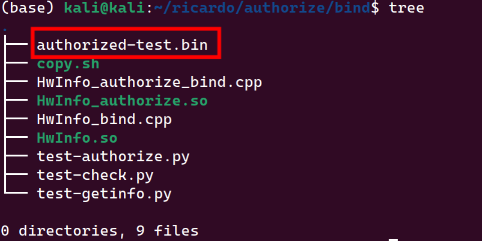
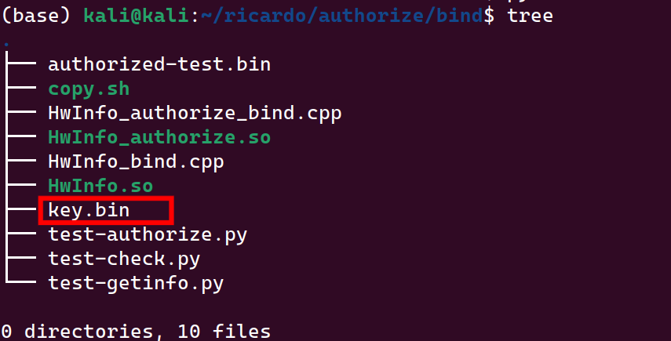
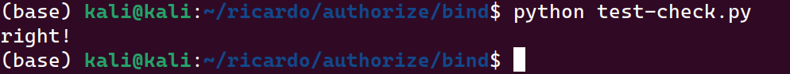
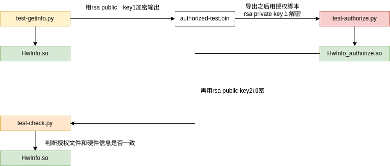
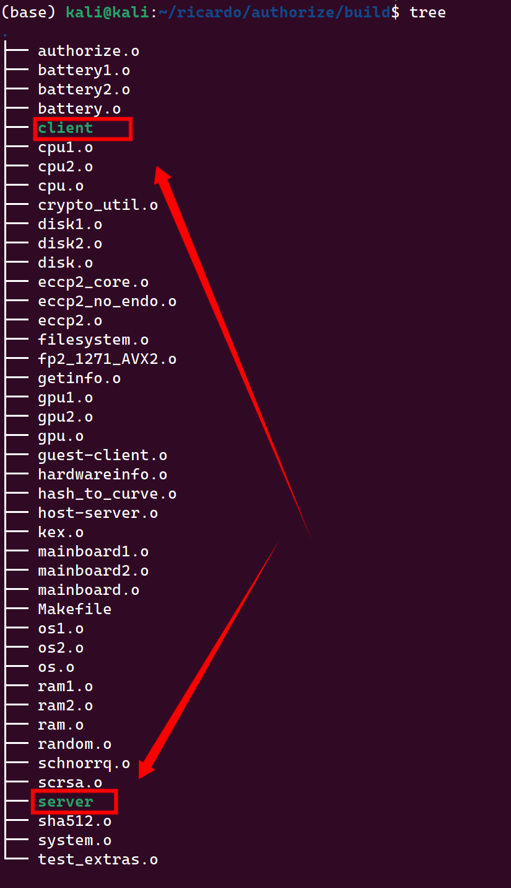
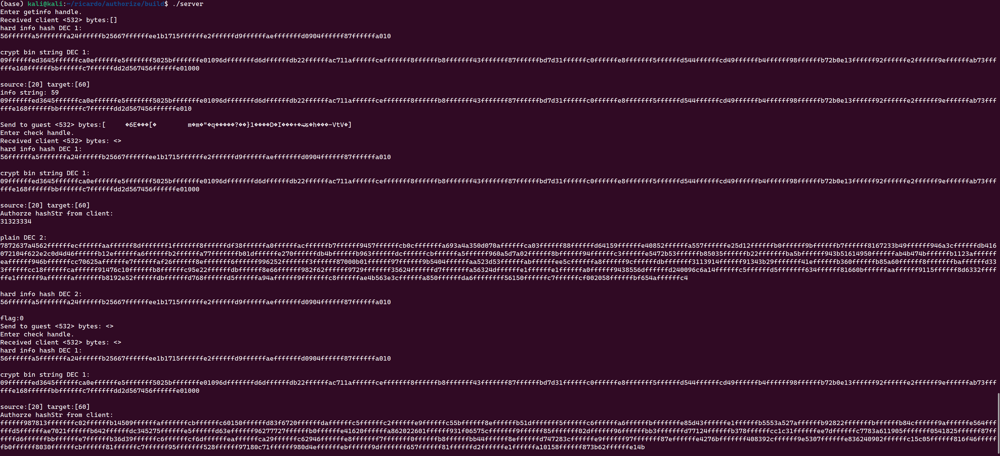
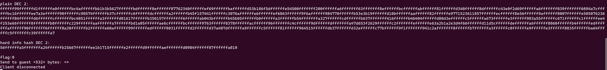
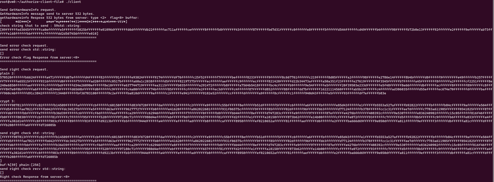
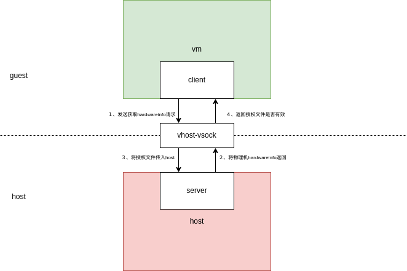

# authorize

Software authorize

submodule: [FourQlib](https://github.com/microsoft/FourQlib)

## building from scratch

``` bash
    cd build
    # compile dynamic library
    make SHARED_FILE=TRUE all -j$(nproc)
    # compile vm program
    make vm -j$(nproc)
```

### compile dynamic library

This command will compile dynamic library, will generate two shared file named 'libHwInfo.so' and 'libHwInfo_authorize.so'.

``` bash
    cd build
    make SHARED_FILE=TRUE all -j$(nproc)
```

- use dynamic library

    In ./bind/ directory, run ./copy script, it will copy two shared library from ./build directory to ./bind directory and rename them to 'HwInfo.so' and 'HwInfo_authorize.so'.

``` bash
    cd bind
    ./copy
```

- test dynamic library
  Run test script in ./bind directory.
  - Run "python test-getinfo.py".
    This comand will get hardware information used dynamic library named 'HwInfo.so'.
    
  - Run "python test-authorize.py".
    This comand will authorize used dynamic library named 'HwInfo_authorize.so'.
    
  - Run "python test-check.py".
    This command will check the authorization file used dynamic library named 'HwInfo_authorize.so'.
    

  

### compile vm program

  Run these program need virtual machine, you can create virtual machine by kvm tools.In project root directory, I privide a script named "create-virtual-machine.sh" to create virtual machine, you can modify some parameters in this script to create virtual machine.And in project root directory, I privide other script named "iptables-tranfer.sh" to transfer virtual machine network port, you can modify some parameters in this script to transfer virtual machine network port.

  Before you run vm program, you need to do some preparation work.Add some configuration in virtual machine xml file.

  ```xml
  <devices>
  !<-- add this code in virtual machine xml file -->
    <vsock model='virtio'>
      <cid auto='no' address='8'/>
      <address type='pci' domain='0x0000' bus='0x07' slot='0x00' function='0x00'/>
    </vsock>
  </devices>
  ```

#### building

This command will compile vm program, will generate two files, "server" and "client"."server" is running in host. "client" is running in virtual machine.

  ``` bash
    cd build
    make vm -j$(nproc)
  ```

  

- copy "clien" to virtual machine.

    ```bash
        scp ./client root@[ip]:/root/[filepath]
    ```

- run "server" in host.

    ```bash
        ./server
    ```

- run "client" in virtual machine.

    ```bash
        ./client
    ```

In host, you can see the output like this.


In virtual machine, you can see the output like this.


